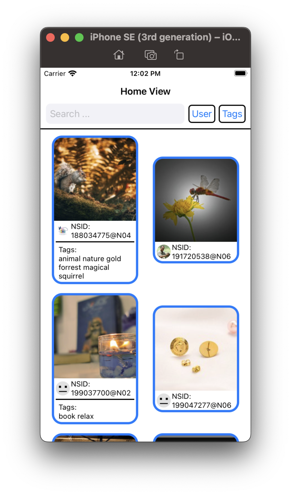
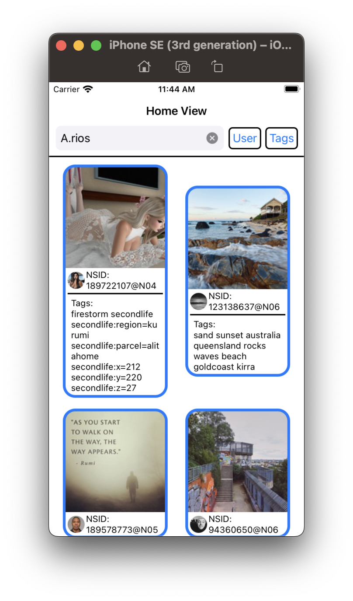
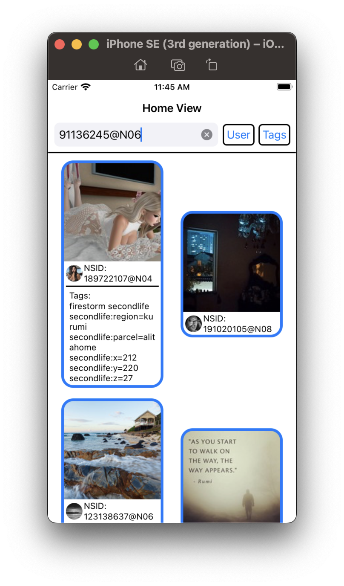
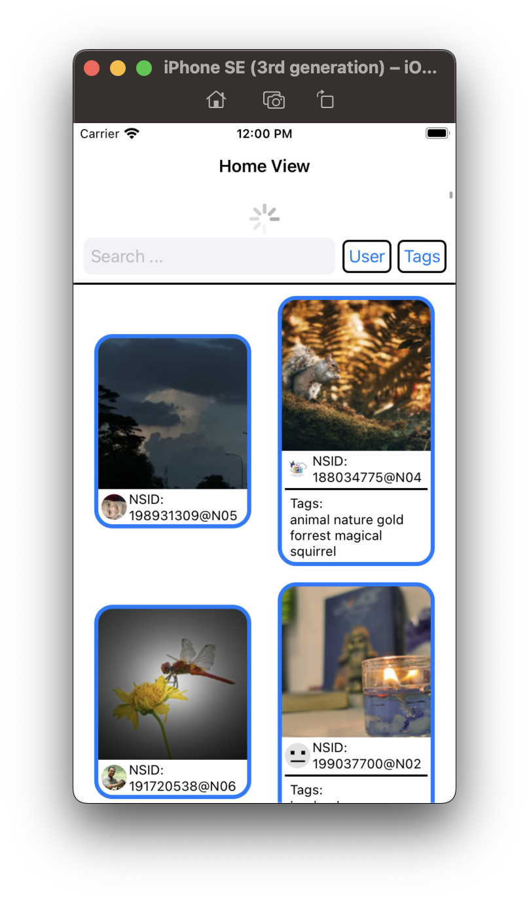
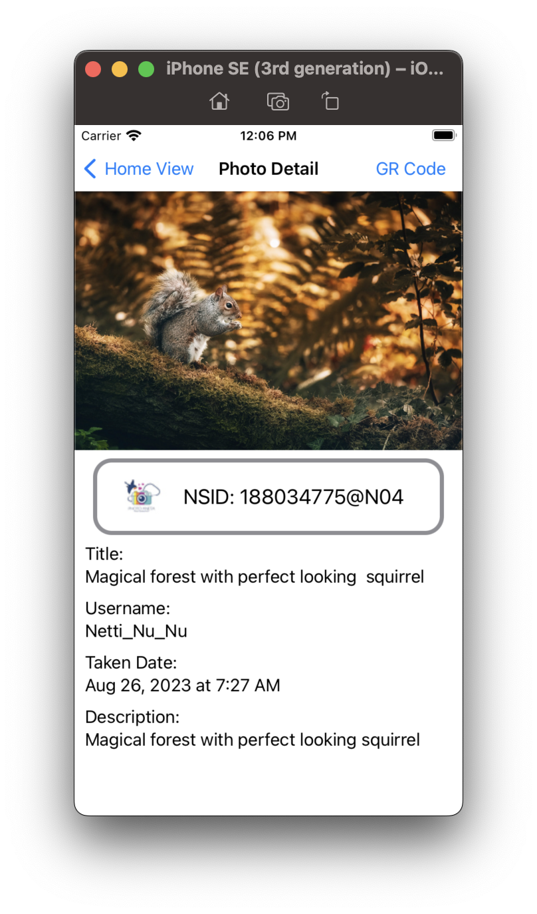
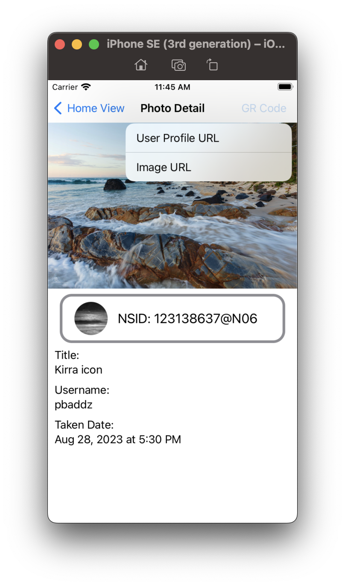
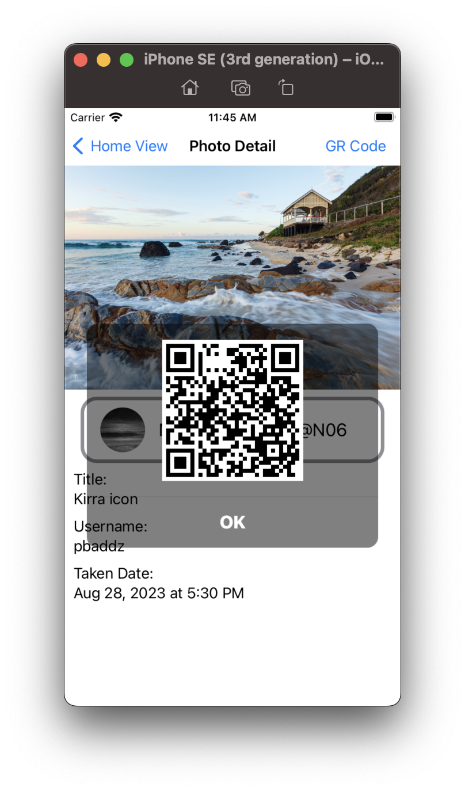
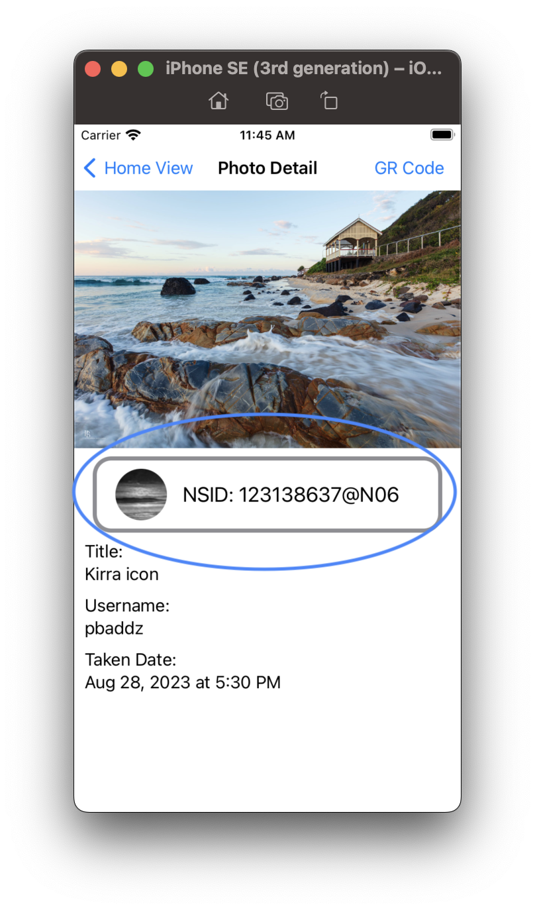
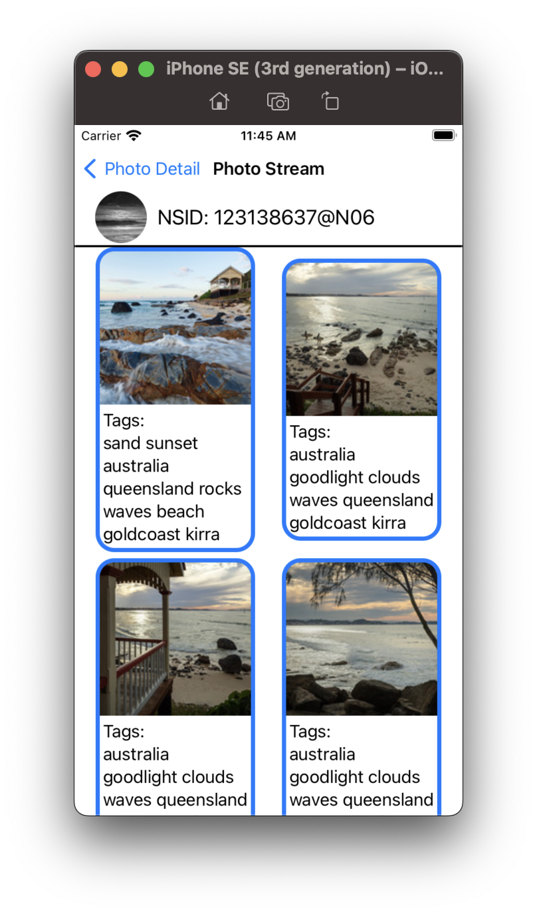

As I was told YBS is using SwiftUI. Although I didn't use SwiftUI more than a year. This project I have used SwiftUI to write.

The app is called `Memory`.

When the app launches, It shows a list of `Recent Photos` were posted by different users alongside with `the user's nsid, icon and tags`.  

User can search photos and user from the search bar.

Typing the tags with comma and tapping `Tags`, it preforms tag search.  

Typing nsid or username and tapping `User`, it preforms user search.

|     |     |
| --- | --- |
|  |  |

Pulling down to refresh Recent Photos.  

Tapping on the cell of the photo, it takes user to the new view to show the `photo in a larger scale, title, username, nsid, user icon, taken date, description`.  

In this view, the right corner has a button to generate a `QR code` of the urls. So, the `photo` and the user's `profile` can be shared by QR Code.

|     |     |
| --- | --- |
|  |  |

Tapping on the button of the icon and nsid, it shows a new view of the user's photo stream.

|     |     |
| --- | --- |
|  |  |